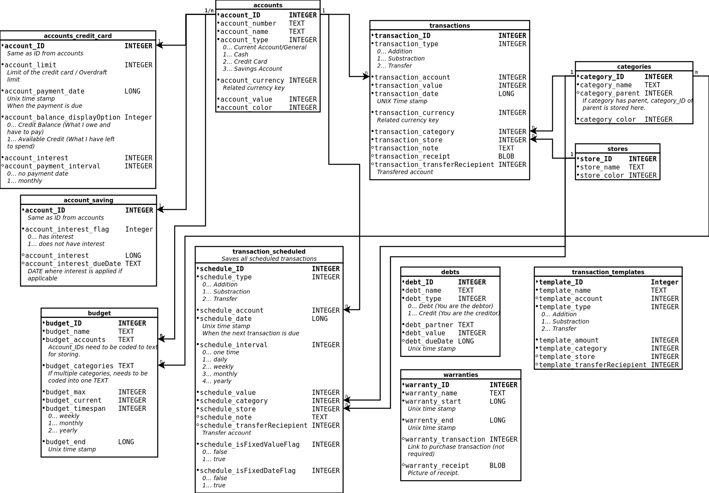
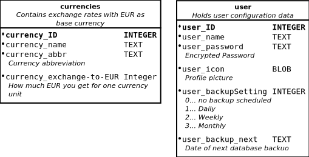

# Concepts

## Delevopment Ideas
#### Data Sync
Summaries, Budgets etc. need to be changed when Transaction gets created, changed or deleted. The best way to implement it seems to be:  

- Retrieving LiveData from the database that can implement an observer as soon as the data changes
- All data points need to be fed with the new data
	- value of budgets change
	- account values change
	- Categories and Store summaries are updated by only the transactions
	- Charts are updated dynamically based on LiveData changes too

## Databases

Multiple databases for separation needed.  
The Database that gets created needs to get the name based on the user. This the user only gets his database. Backup based on user possible that way.  
Databases get encrypted with **SQLCipher** and **Room**

#### Finance database

Store data monthly and daily for 2 years, then archive them into archive database?
#### Configuration database

#### Archive Database
Contains data older then 2 years

